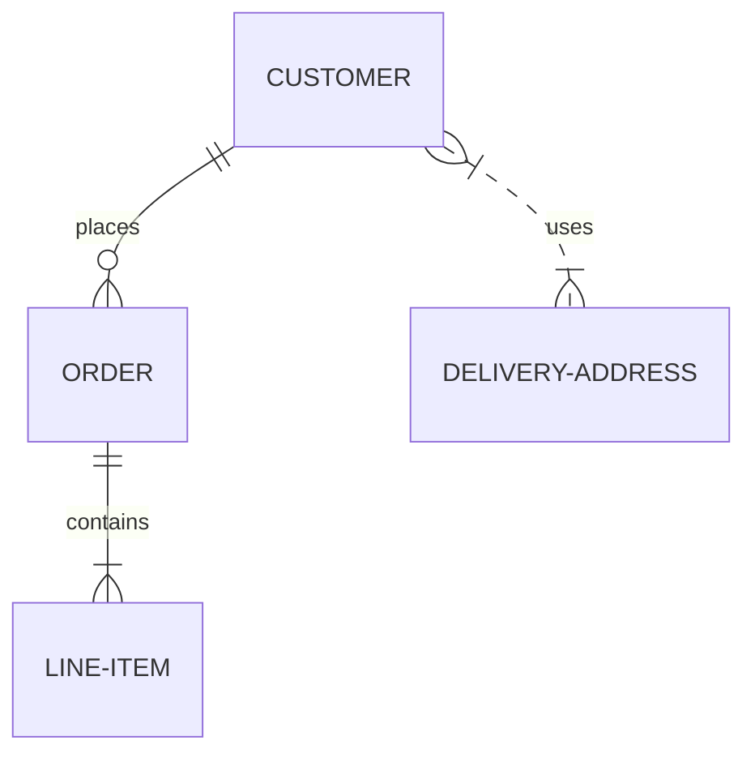

# Dynamic-Robotics-System
C/C++ QT ROBOTICS ESP32 Nvidia-Jetson-Nano Arduino OpenCV 

# Пакет программ и систем для автоматизации робота пожарника !
https://leotronics.eu/en/




---
1. [<b> IEngine_Robotics </b> ](https://github.com/werasaimon/IEngine_Robotics/tree/test)

    > Симулятор робота на основе физического симулятора.
    > Законов физики. [Физика - Ньютона]

---
2. [<b> Robot-Remote_Control </b> ](https://github.com/werasaimon/Robot-Remote_Control/tree/main)

    > Удаленный доступ к роботу через интернет или WiFi-связь !!!
    > [Arduino-Joistik]
---
3. [<b> VideoCameras_PiplineStream </b> ](https://github.com/werasaimon/VideoCameras_PiplineStream/tree/main)

    > Захвата видеопотока и трансляции через интернет или WiFi-связь !!!
    > [OpenCV]
---
4.  [<b> IRCamera_OpenCV__QtWidget </b>  ](https://github.com/werasaimon/IRCamera_OpenCV__QtWidget/tree/main)
    
    > Захвата видеопотока с тепловизора 
    > [Optris IX80]
---
5.  [<b> Robot_SourceCode_-ESP32 </b>  ](https://github.com/werasaimon/Robot_SourceCode_-ESP32-/tree/main)
    
    > Исходный код контроллера управления роботом 
    > [ESP32-WROOM-D1]
 
---


[](https://www.youtube.com/watch?v=mUim0r5UqGg&t=114s)

***
<br/> <br/> 
# IEngine_Robotics 
```
Симулятор робота на основе физического симулятора законов физики [Физика - Ньютона] 
```


---
<br/> <br/> 
***


# Remote Control [Wi-Fi] for Android

```
Удаленный доступ к роботу через интернет или WiFi-связь . 
Приложение джойстик для упраления роботом через Android-Смартфон 
```


---
<br/> <br/> 
***


# IRImage CameraXI* [OpenCV] Camera_Stream [ Client / Server ] 

```
Захвата видеопотока с тепловизоров серии [Optris IX,,,].
Код основан на библиотеки 
```

## Qt-Interface IR_Camera


## Image IRCamera Photo

<br/>

---
<br/> <br/> 
***


# MultiCameras Stream _Client/Server [Qt Widget]

```
Захвата видеопотока с помощю OpenCV и трансляции через интернет или WiFi-связь [Client/Server].
Код основан на библиотеки OpenCV и Qt-Framework 
```


<br/><br/>

* <b> IEngine_Robotics </b> - Симулятор робота на основе физического симулятора законов физики [Физика - Ньютона]
,,,
* <b> Robot-Remote_Control </b> - Удаленный доступ к роботу через интернет или WiFi-связь [Arduino-Joistik]
,,,
* <b> VideoCameras_PiplineStream </b> - Захвата видеопотока и трансляции через интернет или WiFi-связь [OpenCV]
,,,
* <b> IRCamera_OpenCV__QtWidget </b> - Захвата видеопотока с тепловизора [Optris IX80]
,,,
* <b> Robot_SourceCode_-ESP32  </b> - Исходный код контроллера управления роботом [ESP32-WROOM-D1]
,,,
<br/>

